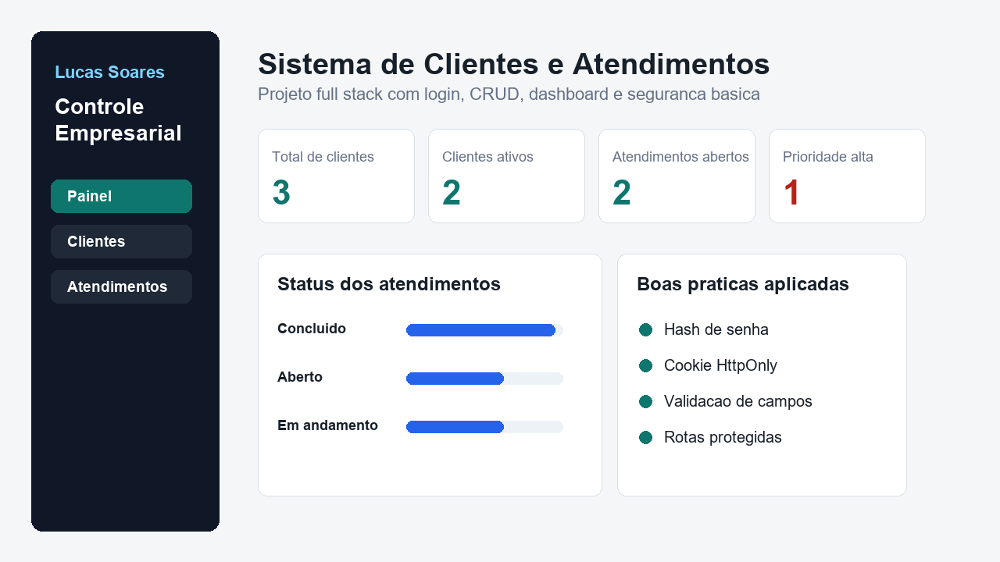

# Sistema de Clientes e Atendimentos

Aplicação web full stack desenvolvida para gerenciar clientes e acompanhar atendimentos em um ambiente empresarial.

O sistema possui autenticação, cadastro de clientes, histórico de atendimentos, filtros e dashboard de indicadores.

[Ver demonstração online](https://sistema-clientes-atendimentos.onrender.com)



---

## Sobre o projeto

Este projeto foi inspirado em rotinas empresariais com as quais tive contato profissionalmente, como atendimento ao cliente, organização de informações, análise de dados e utilização de sistemas ERP.

O objetivo foi desenvolver uma aplicação funcional para praticar desenvolvimento full stack, regras de negócio, autenticação e segurança básica.

---

## Funcionalidades

- Login e encerramento de sessão
- Cadastro, edição e exclusão de clientes
- Registro, edição e exclusão de atendimentos
- Associação de atendimentos aos clientes
- Classificação por prioridade e status
- Dashboard com indicadores operacionais
- Validação de campos obrigatórios
- Rotas protegidas para usuários autenticados
- Exclusão dos atendimentos relacionados ao remover um cliente

---

## Tecnologias

- JavaScript
- Node.js
- HTML5
- CSS3
- API HTTP
- Persistência de dados em JSON
- Git e GitHub

O servidor foi construído utilizando módulos nativos do Node.js, sem frameworks externos.

---

## Segurança implementada

- Hash de senhas com PBKDF2
- Comparação segura de senhas
- Sessões com expiração
- Cookies `HttpOnly` e `SameSite=Lax`
- Validação e limitação dos dados recebidos
- Proteção das rotas da API
- Proteção contra acesso a arquivos fora da pasta pública
- Cabeçalho `X-Content-Type-Options`

> Este é um projeto educacional. Para utilização em produção, seriam necessárias medidas adicionais de segurança, persistência e monitoramento.

---

## Demonstração

Acesse:

```text
https://sistema-clientes-atendimentos.onrender.com
```

### Credenciais de demonstração

```text
E-mail: admin@demo.com
Senha: admin123
```

A aplicação utiliza dados de demonstração e pode levar alguns segundos para iniciar.

---

## Como executar localmente

### Pré-requisito

- Node.js instalado

### Clone o repositório

```bash
git clone https://github.com/olucassoares/sistema-clientes-atendimentos.git
```

### Entre na pasta

```bash
cd sistema-clientes-atendimentos
```

### Inicie a aplicação

```bash
npm start
```

Acesse:

```text
http://localhost:3000
```

---

## Estrutura do projeto

```text
sistema-clientes-atendimentos/
├── data/
│   └── db.json
├── docs/
│   └── preview.png
├── public/
│   ├── index.html
│   ├── app.html
│   ├── script.js
│   └── style.css
├── package.json
├── server.js
└── README.md
```

---

## Endpoints principais

| Método | Endpoint | Descrição |
|---|---|---|
| POST | `/api/login` | Autentica o usuário |
| POST | `/api/logout` | Encerra a sessão |
| GET | `/api/me` | Retorna o usuário autenticado |
| GET | `/api/dashboard` | Retorna os indicadores |
| GET | `/api/clients` | Lista os clientes |
| POST | `/api/clients` | Cadastra um cliente |
| PUT | `/api/clients/:id` | Atualiza um cliente |
| DELETE | `/api/clients/:id` | Exclui um cliente |
| GET | `/api/tickets` | Lista os atendimentos |
| POST | `/api/tickets` | Registra um atendimento |
| PUT | `/api/tickets/:id` | Atualiza um atendimento |
| DELETE | `/api/tickets/:id` | Exclui um atendimento |

---

## Aprendizados

Durante o desenvolvimento deste projeto, pratiquei:

- Estruturação de uma aplicação web com Node.js
- Criação de rotas e operações CRUD
- Autenticação e gerenciamento de sessões
- Manipulação e persistência de dados
- Validação de informações recebidas pela API
- Integração entre front-end e back-end
- Aplicação de regras de negócio
- Publicação de uma aplicação web

---

## Próximas melhorias

- Migrar a persistência para PostgreSQL
- Separar rotas, serviços e controladores
- Criar uma interface utilizando React
- Adicionar paginação e pesquisa de clientes
- Implementar níveis de acesso
- Adicionar testes automatizados
- Documentar a API com Swagger
- Utilizar variáveis de ambiente
- Implementar tratamento centralizado de erros

---

## Autor

**Lucas Soares**

- GitHub: [olucassoares](https://github.com/olucassoares)
- LinkedIn: [Lucas Soares](https://www.linkedin.com/in/olucassoares/)
